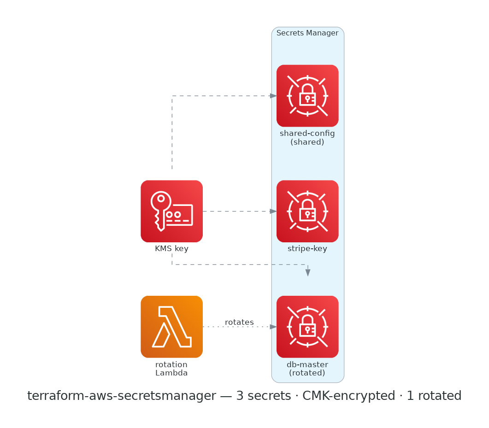

# terraform-aws-secretsmanager

[](https://github.com/devotica-labs/terraform-aws-secretsmanager/actions/workflows/ci.yml)
[](https://github.com/devotica-labs/terraform-aws-secretsmanager/actions/workflows/release.yml)
[](LICENSE)

AWS **Secrets Manager** module for the Devotica catalog. Manages a map of secrets — each with KMS encryption, a generous deletion-recovery window, an optional resource policy (public access blocked), optional Lambda rotation, and optional cross-region replicas.

This module is written in the Devotica house style: native (no external modules), validated inputs, plan-only unit + contract tests, terraform-docs auto-update, central reusable CI from `devotica-labs/terraform-shared-config`, conftest policies from `devotica-labs/terraform-policies`, and signed releases with CycloneDX SBOMs.

<!-- BEGIN_ARCH -->



<sub>Generated by `.github/workflows/architecture-diagram.yml` on every push to main. Do not edit the image by hand — change the Terraform code in `examples/complete/` and the bot will regenerate it.</sub>

<!-- END_ARCH -->

## Scope

| Surface | Covered |
|---|---|
| Multiple secrets in one call (`for_each` map) | ✅ |
| KMS encryption (module default + per-secret override) | ✅ |
| Deletion recovery window (7-30 days, or force) | ✅ |
| Resource policy (public access blocked) | ✅ |
| Lambda rotation | ✅ |
| Cross-region replicas | ✅ |
| Bootstrap initial value (state-stored, opt-in) | ✅ |
| AWS-managed rotation (no Lambda) | ❌ (planned) |
| SSM Parameter Store | ❌ (separate concern) |

## Quick start

Each secret's name is `<namespace>-<environment>-<stage>-<name>/<map-key>`, e.g. `dvtca-prod-payments/db-password`.

```hcl
module "secrets" {
  source  = "devotica-labs/secretsmanager/aws"
  version = "~> 0.1"

  namespace = "dvtca"
  stage     = "prod"
  name      = "payments"

  # Encrypt every secret with a customer-managed key (recommended for fintech):
  kms_key_id = module.kms.key_arn

  secrets = {
    "db-password" = { description = "Payments DB password" }
    "stripe-key"  = { description = "Stripe secret key" }
  }

  tags = {
    Environment = "production"
    Project     = "payments"
    Owner       = "platform@example.com"
    CostCenter  = "PLATFORM"
    ManagedBy   = "Terraform"
  }
}
```

See [`examples/complete`](examples/complete/main.tf) for rotation, a cross-account resource policy, a cross-region replica, and a bootstrap value.

## Defaults that matter

Annotated `# Devotica fintech default` in [`variables.tf`](variables.tf):

- **`recovery_window_in_days = 30`** — the maximum, so an accidental delete is reversible for a month. Set `0` only when you truly want force-delete.
- **`block_public_policy = true`** — any attached resource policy that would grant public access is rejected.
- **`kms_key_id`** — pass a customer-managed key (e.g. a `terraform-aws-kms` output) to encrypt all secrets; per-secret `kms_key_id` overrides it. Omitting it falls back to the AWS-managed `aws/secretsmanager` key (still encrypted, zero cost).

### A note on values

This module **does not require you to put secret values in Terraform**. By default it creates empty secrets; populate them out-of-band (console/CLI) or via **rotation**. For bootstrap you may set `set_initial_value = true` on a secret and pass its value in the separate `secret_values` map — but that value **is stored in Terraform state**, so treat state as sensitive and prefer rotation for anything long-lived.

## How this fits the Devotica catalog

```
terraform-aws-kms                terraform-aws-secretsmanager
   │ encryption key (CMK)  ─────▶  │ secret ARNs
                                   ▼
   consumers grant their task/exec roles read on specific secret ARNs:
   terraform-aws-rds (master password)   terraform-aws-ecs-fargate / eks
   terraform-aws-elasticache-redis (auth token)   (app secrets via `secrets`)
```

Encrypt with a `terraform-aws-kms` key, then hand the `secret_arns` output to the modules that consume them (the ECS execution role, an app IAM policy, etc.) so they can `GetSecretValue` on exactly those ARNs.

## Governance

- CI runs the central reusable workflow from `devotica-labs/terraform-shared-config`: fmt, validate, tflint, tfsec/trivy, gitleaks, terraform-docs, conftest against `devotica-labs/terraform-policies`, terraform test, checkov, examples build.
- Releases are cut by `release-please` on Conventional Commits. Each release is keyless-signed via cosign and ships a CycloneDX SBOM.
- Dependabot PRs auto-approve + auto-merge once CI is green.

<!-- BEGIN_TF_DOCS -->


## Usage

### Basic

```hcl
# ---------------------------------------------------------------------------
# Provider block — CI-friendly skip flags + non-AWS-shaped placeholder creds.
# ---------------------------------------------------------------------------
provider "aws" {
  region                      = "ap-south-1"
  access_key                  = "not-a-real-aws-key"
  secret_key                  = "not-a-real-aws-secret"
  skip_credentials_validation = true
  skip_metadata_api_check     = true
  skip_requesting_account_id  = true
}

# Uses local path during development.
# Change to Registry source after first release:
#   source  = "devotica-labs/secretsmanager/aws"
#   version = "~> 0.1"

module "secrets" {
  source = "../.."

  # Names compose to: dvtca-sandbox-app/<key>
  namespace = "dvtca"
  stage     = "sandbox"
  name      = "app"

  # Encrypt every secret with a workload KMS key (a terraform-aws-kms output).
  kms_key_id = "arn:aws:kms:ap-south-1:111122223333:key/00000000-0000-0000-0000-000000000000"

  secrets = {
    "db-password" = { description = "Application database password" }
    "api-key"     = { description = "Third-party API key" }
  }

  tags = {
    Environment = "sandbox"
    Project     = "terraform-aws-secretsmanager"
    Owner       = "platform@devotica.com"
    CostCenter  = "PLATFORM-OSS"
    ManagedBy   = "Terraform"
    Repo        = "https://github.com/devotica-labs/terraform-aws-secretsmanager"
  }
}
```

### Complete

```hcl
# ---------------------------------------------------------------------------
# Provider block — CI-friendly skip flags + non-AWS-shaped placeholder creds.
# ---------------------------------------------------------------------------
provider "aws" {
  region                      = "ap-south-1"
  access_key                  = "not-a-real-aws-key"
  secret_key                  = "not-a-real-aws-secret"
  skip_credentials_validation = true
  skip_metadata_api_check     = true
  skip_requesting_account_id  = true
}

# Uses local path during development.
# Change to Registry source after first release:
#   source  = "devotica-labs/secretsmanager/aws"
#   version = "~> 0.1"

module "secrets" {
  source = "../.."

  # Names compose to: dvtca-aps1-prod-payments/<key>
  namespace   = "dvtca"
  environment = "aps1"
  stage       = "prod"
  name        = "payments"

  # Default CMK for every secret (a terraform-aws-kms output).
  kms_key_id = "arn:aws:kms:ap-south-1:111122223333:key/00000000-0000-0000-0000-000000000000"

  secrets = {
    # Rotated DB master credential.
    "db-master" = {
      description = "Payments DB master credentials (rotated)"
      rotation = {
        lambda_arn               = "arn:aws:lambda:ap-south-1:111122223333:function:rotate-rds"
        automatically_after_days = 30
      }
    }

    # Bootstrap a value once, then manage it out-of-band; replicate to DR region.
    "stripe-key" = {
      description             = "Stripe secret key"
      recovery_window_in_days = 7
      set_initial_value       = true
      replica_regions = [
        { region = "ap-southeast-1" },
      ]
    }

    # Shared read-only with another account via a scoped resource policy.
    "shared-config" = {
      description = "Config shared read-only with the analytics account"
      policy = jsonencode({
        Version = "2012-10-17"
        Statement = [{
          Sid       = "AllowAnalyticsRead"
          Effect    = "Allow"
          Principal = { AWS = "arn:aws:iam::444455556666:root" }
          Action    = ["secretsmanager:GetSecretValue"]
          Resource  = "*"
        }]
      })
    }
  }

  # Bootstrap value for stripe-key (sensitive — stored in state).
  secret_values = {
    "stripe-key" = "sk_test_bootstrap_value_replace_me_1234567890"
  }

  tags = {
    Environment = "production"
    Project     = "payments"
    Owner       = "platform@devotica.com"
    CostCenter  = "PLATFORM"
    ManagedBy   = "Terraform"
    Repo        = "https://github.com/devotica-labs/terraform-aws-secretsmanager"
  }
}
```

## Requirements

| Name | Version |
|------|---------|
| <a name="requirement_terraform"></a> [terraform](#requirement\_terraform) | >= 1.5.0 |
| <a name="requirement_aws"></a> [aws](#requirement\_aws) | >= 5.0.0 |
## Providers

| Name | Version |
|------|---------|
| <a name="provider_aws"></a> [aws](#provider\_aws) | >= 5.0.0 |
## Resources

| Name | Type |
|------|------|
| [aws_secretsmanager_secret.this](https://registry.terraform.io/providers/hashicorp/aws/latest/docs/resources/secretsmanager_secret) | resource |
| [aws_secretsmanager_secret_policy.this](https://registry.terraform.io/providers/hashicorp/aws/latest/docs/resources/secretsmanager_secret_policy) | resource |
| [aws_secretsmanager_secret_rotation.this](https://registry.terraform.io/providers/hashicorp/aws/latest/docs/resources/secretsmanager_secret_rotation) | resource |
| [aws_secretsmanager_secret_version.this](https://registry.terraform.io/providers/hashicorp/aws/latest/docs/resources/secretsmanager_secret_version) | resource |
## Inputs

| Name | Description | Type | Default | Required |
|------|-------------|------|---------|:--------:|
| <a name="input_block_public_policy"></a> [block\_public\_policy](#input\_block\_public\_policy) | Reject any attached resource policy that would grant public access. | `bool` | `true` | no |
| <a name="input_delimiter"></a> [delimiter](#input\_delimiter) | Delimiter joining the name-prefix segments. | `string` | `"-"` | no |
| <a name="input_enabled"></a> [enabled](#input\_enabled) | Set to false to make this module a no-op (create nothing). | `bool` | `true` | no |
| <a name="input_environment"></a> [environment](#input\_environment) | Environment segment used to compose secret names (e.g. a short region code). | `string` | `null` | no |
| <a name="input_kms_key_id"></a> [kms\_key\_id](#input\_kms\_key\_id) | Default customer-managed KMS key (ARN or ID) used to encrypt all secrets. Per-secret `kms_key_id` overrides it. Null uses the AWS-managed `aws/secretsmanager` key — prefer a CMK from terraform-aws-kms for fintech workloads. | `string` | `null` | no |
| <a name="input_name"></a> [name](#input\_name) | Base name used to compose secret names (e.g. "payments"). | `string` | `null` | no |
| <a name="input_namespace"></a> [namespace](#input\_namespace) | Namespace / org prefix used to compose secret names (e.g. "dvtca"). | `string` | `null` | no |
| <a name="input_recovery_window_in_days"></a> [recovery\_window\_in\_days](#input\_recovery\_window\_in\_days) | Default deletion recovery window. 0 forces immediate deletion (no recovery); 7-30 keeps the secret recoverable. Devotica defaults to the maximum. | `number` | `30` | no |
| <a name="input_secret_values"></a> [secret\_values](#input\_secret\_values) | Optional initial plaintext values, keyed by the same keys as `secrets` (only used where `set_initial_value = true`). STORED IN TERRAFORM STATE — prefer rotation; use for bootstrap only. | `map(string)` | `{}` | no |
| <a name="input_secrets"></a> [secrets](#input\_secrets) | Map of secrets to manage, keyed by a short logical name. The key becomes the secret-name suffix unless `name_override` is set. | <pre>map(object({<br/>    # Full secret name. When null, the name is "<prefix>/<map-key>".<br/>    name_override = optional(string)<br/>    description   = optional(string)<br/><br/>    # Per-secret KMS key (overrides the module-level kms_key_id).<br/>    kms_key_id = optional(string)<br/><br/>    # Per-secret deletion recovery window (overrides recovery_window_in_days).<br/>    recovery_window_in_days = optional(number)<br/><br/>    # Resource policy JSON (e.g. cross-account read access).<br/>    policy = optional(string)<br/><br/>    # Cross-region replicas.<br/>    replica_regions = optional(list(object({<br/>      region     = string<br/>      kms_key_id = optional(string)<br/>    })), [])<br/><br/>    # Lambda-based rotation. Omit to disable rotation for this secret.<br/>    rotation = optional(object({<br/>      lambda_arn               = string<br/>      automatically_after_days = optional(number)<br/>      duration                 = optional(string)<br/>      schedule_expression      = optional(string)<br/>    }))<br/><br/>    # Set true to seed an initial value from `secret_values[<key>]` at create.<br/>    # The value is STORED IN STATE — prefer rotation; use for bootstrap only.<br/>    set_initial_value = optional(bool, false)<br/><br/>    tags = optional(map(string), {})<br/>  }))</pre> | `{}` | no |
| <a name="input_stage"></a> [stage](#input\_stage) | Stage / account segment used to compose secret names (e.g. "prod"). | `string` | `null` | no |
| <a name="input_tags"></a> [tags](#input\_tags) | Tags applied to every secret this module creates. | `map(string)` | `{}` | no |
## Outputs

| Name | Description |
|------|-------------|
| <a name="output_kms_key_ids"></a> [kms\_key\_ids](#output\_kms\_key\_ids) | Map of logical key → the KMS key ID encrypting each secret (null = AWS-managed key). |
| <a name="output_rotation_enabled"></a> [rotation\_enabled](#output\_rotation\_enabled) | Map of logical key → whether Lambda rotation is configured. |
| <a name="output_secret_arns"></a> [secret\_arns](#output\_secret\_arns) | Map of logical key → secret ARN. |
| <a name="output_secret_ids"></a> [secret\_ids](#output\_secret\_ids) | Map of logical key → secret ID (ARN). |
| <a name="output_secret_names"></a> [secret\_names](#output\_secret\_names) | Map of logical key → full secret name. |
<!-- END_TF_DOCS -->

## License

Apache-2.0. See [`LICENSE`](LICENSE) and [`NOTICE`](NOTICE).
